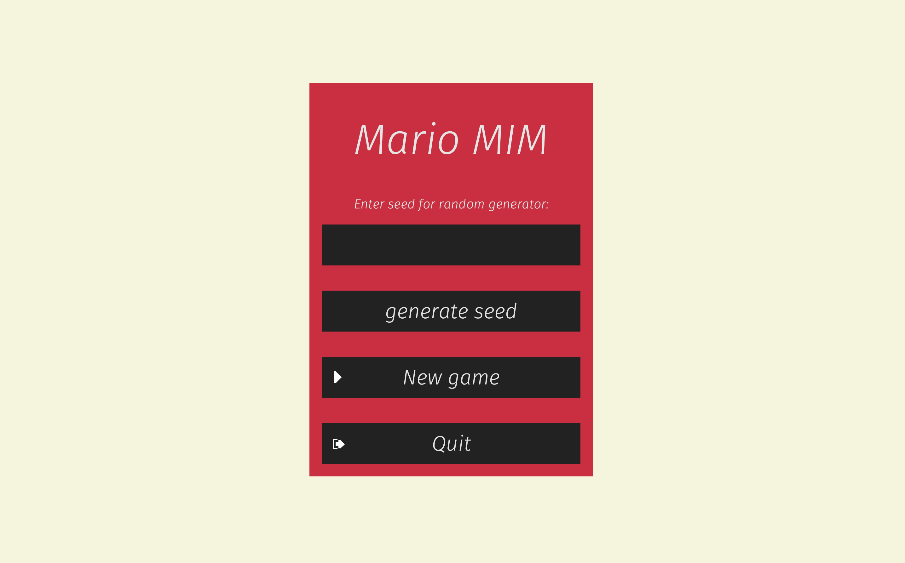
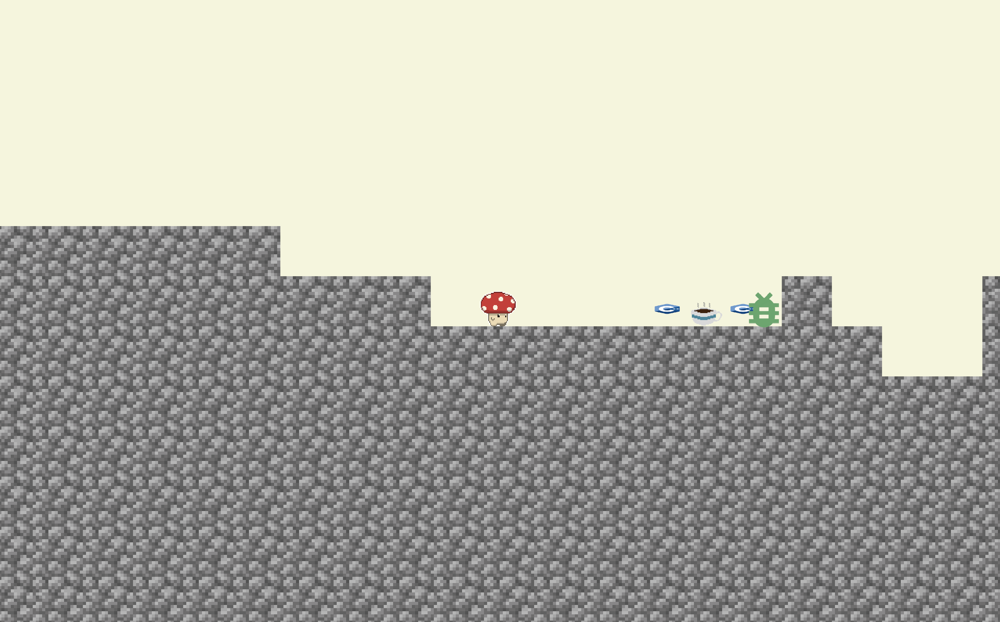
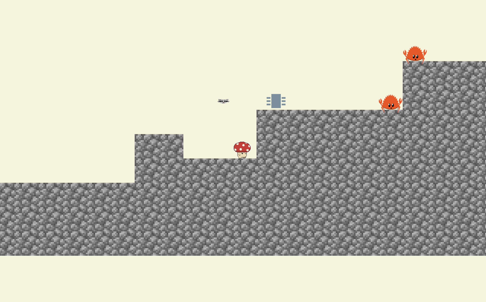

# MarioMIM

## Description
Since the moment CLion has shown us the first segfaults, we wanted to create a computer game inspired 
by the student’s adventure of pursuing a Computer Science degree. MarioMIM is a platform game whose 
main goal is to... get a degree. We’ve implemented a game inspired by Super Mario Bros, but in the 
special University of Warsaw edition. In order to overcome bugs, the student can strengthen himself 
by drinking coffee or learning the best programming language in the world - Rust.

## How to play
- **Online**\
[click here!](https://pbundyra.github.io/wasm-deploy/)
- **Local**\
Set up your computer according to [this guide](https://bevyengine.org/learn/book/getting-started/setup/), 
clone this repo and start the game by `cargo run` command

## Libraries
- [Bevy](https://bevyengine.org)
- [Rapier](https://rapier.rs)
- [Kira](https://github.com/tesselode/kira)

## Learning sources
- https://dev.to/sbelzile/rust-platformer-part-1-bevy-and-ecs-2pci
- https://www.youtube.com/watch?v=j7qHwb7geIM&ab_channel=JeremyChone
- https://www.youtube.com/watch?v=Yb3vInxzKGE&list=PL7r-PXl6ZPcCB_9zZFU0krBoGK3y5f5Vt&index=5&ab_channel=JeremyChone
- https://github.com/bevyengine/bevy/tree/latest/examples

## Authors
[Katarzyna Kloc](https://github.com/KatKlo) - kk429317@students.mimuw.edu.pl\
[Patryk Bundyra](https://github.com/PBundyra) - pb429159@students.mimuw.edu.pl

## Screenshots

